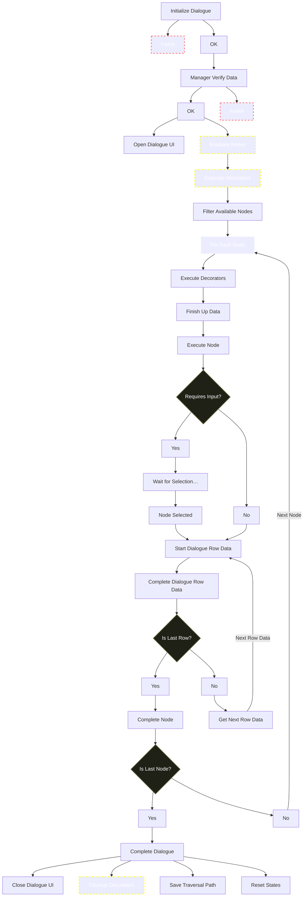

---
tags:
  - tutorial
  - dialogue
  - flow
---

# Dialogue Flow

An illustrated overview of how the Mountea Dialogue System processes a conversation at runtime, from initialization through to dialogue completion.

---

